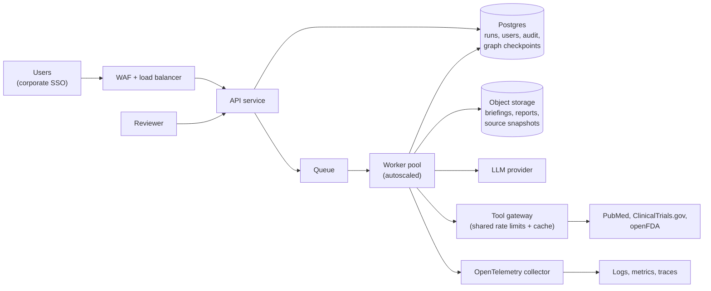

# From demo to production: thoughts on running mash-agent at a pharma company

**Status: thinking, not a plan.** Nothing in this document has been built or tested. The demo has only ever run one or two questions at a time, from a laptop or a single container. This memo records what I think a production deployment would need, in rough priority order, what would change in this codebase, and what I do not know. Regulatory and compliance points are pointers to check with the people who own them, not advice.

## 1. Start with intended use, because it decides how much of this you need

The same code could serve very different uses, with very different obligations:

| Intended use | Example | What follows |
|---|---|---|
| Exploratory research aid for a small team | A medical-affairs analyst scanning the landscape before a meeting | Light governance: SSO, audit log, cost caps |
| Input to work products that others rely on | Briefing decks, competitive-intelligence summaries, responses to internal questions | Reviewer roles, retained evidence, change control, a documented validation approach |
| Anything touching regulated records or decisions | Content in submissions, promotional materials, safety processes | Full quality-system treatment; probably a different design conversation |

The project's own position is that it is a demo and not a clinical tool. I would keep that position in production, and the first task is to write down which row above a deployment falls in and to get the quality and regulatory owners to agree. Everything below is scaled to the first two rows.

## 2. What the workload actually looks like

- **A run is I/O-bound.** In the evals it takes roughly 15 to 60 seconds and costs about $0.05 (one specialist) to $0.40 (all three), nearly all of it waiting on the LLM and three public APIs. One small container running asyncio can handle many runs at once.
- **The real limits are external:** the LLM provider's rate limits, NCBI's limits (about 3 requests per second without an API key and about 10 with one, per [NCBI's E-utilities guidance](https://www.ncbi.nlm.nih.gov/books/NBK25497/); verify current figures), and cost.
- **More machines increase throughput, not latency.** Per-run latency is set by model calls. Distribution buys availability, isolation, and volume, not speed.
- **So Kubernetes is not the first thing to add.** Container services such as ECS on Fargate are simpler at this scale. Kubernetes earns its keep if the company already runs a platform team and many services on it, or needs custom scheduling. That is a platform decision more than a workload one.

## 3. Target architecture (one reasonable shape)

- **API layer:** authenticated endpoints to submit a question, read run status and progress, submit an approve or reject decision, and download artifacts by short-lived link.
- **Queue and workers:** a queue decouples submission from execution. Workers pull jobs and autoscale on queue depth. The visibility timeout must exceed the longest expected run, failed jobs go to a dead-letter queue, and jobs must be idempotent.
- **Orchestration:** keep LangGraph as the orchestrator inside a worker, with durable checkpoints. The queue only carries "start this run" and "resume this run with a decision". A separate workflow engine (for example Step Functions) would discard the graph code and add infrastructure for no clear gain here.
- **Data:** a relational database for users, runs, decisions and the audit log; object storage for artifacts. If the company standard is AWS, that means Postgres on RDS or Aurora, S3, SQS, and ECS or EKS. The design does not depend on the vendor.

## 4. What changes in this codebase

| Demo today | Production replacement |
|---|---|
| In-memory graph checkpointer (`MemorySaver`) | A durable checkpointer (LangGraph provides a Postgres implementation, `langgraph-checkpoint-postgres`) so a run can pause and resume on any worker |
| Approval prompt at the terminal | An approval API and run states: `queued`, `running`, `awaiting_approval`, `approved`, `rejected`, `failed`, with an expiry, reminders and notifications |
| `--auto-approve` flag | Disabled in production (it exists for evals and CI). Approval is the control that makes the output reviewable. |
| `Workflow.run`: start and approval loop in one call | Separate "start" and "resume with decision" operations |
| Metering held in a memory object inside `run` | Persisted with the run (see section 5) |
| Local files: `briefing.md`, `run_report.json`, `trace.jsonl` | Object storage plus database rows, written immutably |
| On-disk API cache | A shared cache (for example Redis or object storage) |
| Per-process rate limiter | A distributed limiter, or one "tool gateway" per data source. This matters most for PubMed, whose limits are shared by every worker behind the same address or key. |
| In-process MCP servers | Keep them in-process at first. Split them into network services only if independent scaling or central rate limiting is needed. |
| `trace.jsonl` exporter | An OTLP exporter to a collector (OpenTelemetry provides one, `opentelemetry-exporter-otlp-proto-http`) |
| Environment variables for keys and config | A secrets manager, with a role per service instead of long-lived keys |

## 5. Human review, pause and resume, and crash recovery

The approval gate is the reason a run pauses, and it is the main reason a durable checkpointer matters.

- **Today:** after synthesis the graph calls `interrupt()`. The state sits in memory, in the same process that is waiting at the terminal, so a person must answer while that process is alive.
- **In production:** a reviewer might decide minutes, hours or days later, through a web page, and the worker that produced the briefing may be gone. With a Postgres checkpointer the graph saves its state at the interrupt and the worker finishes. The run's status becomes `awaiting_approval` and the reviewer is notified. When the decision arrives, a job is queued, any worker loads the saved state and continues (in our code, `Command(resume=...)`), and the remaining step is writing the result.
- **Crash recovery uses the same mechanism.** State is saved after each step, so a run interrupted by a crash can be resumed from its last saved step without re-running finished steps. Granularity is per step: a crash mid-step loses that step's partial work, and its model calls are paid for again. In this system that is at most about one stage (on the order of 15 seconds and $0.05 to $0.15, my estimate from measured runs). Systems that log every individual activity (Temporal, Step Functions) are finer-grained but heavier.
- **A checkpointer does not restart anything itself.** The queue's redelivery does, and it needs an attempt counter and a dead-letter queue so that a run that always crashes does not loop.
- **A gap this exposes in our code:** token, cost and latency metering live in a memory object created inside `Workflow.run`, not in the graph state. After a resume on another worker, earlier stages' usage would be missing and the cost undercounted. It has to be persisted with the run.
- **Pending approvals need housekeeping** that the checkpointer does not provide: an expiry, reminders, and a defined rule for who may approve.
- **Review design matters as much as the plumbing.** The gate is only a real control if reviewers look. Show claim-level verdicts and the source text next to each claim, and track approval rates and review times, because a reviewer who approves everything in seconds is a warning sign (automation bias).

## 6. Identity, access and audit

- **Authentication:** sign-in through the company identity provider (OIDC or SAML), validated at the edge, not custom accounts.
- **Authorisation:** roles for requester, reviewer and administrator, with the rule for who may approve made explicit. Decide whether a requester may approve their own briefing (I would say not, for anything others rely on).
- **The briefing footer says "approved by a person".** In production that statement needs to be provable: a stored record of who approved, when, and the exact briefing text they saw.
- **Quotas:** per-user and per-team rate limits and spend caps. Each run costs money, so a public or shared endpoint needs them.
- **Tenancy:** if several teams use it, isolate their data (row-level rules in the database, prefixes and policies in object storage).

## 7. Network, secrets and LLM access

- **Network:** workers in private subnets; only the load balancer is public. Egress to the LLM provider and the three public APIs goes through a NAT or an egress proxy with a domain allowlist. Private endpoints for storage, queue, secrets and container registry keep that traffic off the NAT. A web application firewall and TLS at the front.
- **Secrets:** API keys in a secrets manager, injected at runtime, never in images (the current Dockerfile already passes them at run time).
- **LLM access:** either the provider's API over egress, or the same models through the cloud vendor's managed service (for example Amazon Bedrock), which brings the vendor's quotas, billing and private connectivity. Model IDs and feature availability can differ by platform, so verify that structured outputs and the model we use behave the same before committing. Pin the exact model version in configuration.
- **Prompt injection:** retrieved abstracts, trial records and labels are untrusted text fed to a model. The design limits the damage (no tools with side effects, structured outputs, a critic, a human gate), but it should be treated as a threat and tested for, not assumed away.

## 8. Observability and operations

- **Already in place:** OpenTelemetry spans for every stage, LLM call and tool call; per-stage token, cost and latency accounting; run reports with the critic's verdicts.
- **To add:** structured logs carrying `run_id`, user and trace IDs; metrics (queue depth, run latency percentiles, cost per run, the critic's exclusion rate, provider 429 and 529 rates); dashboards and alerts; per-team cost reports.
- **Retention:** user questions and generated claims can be sensitive (a pipeline question reveals what a team is looking at). Decide what is logged, for how long, and who can read it.
- **Provider outages:** circuit breakers and backpressure, so the queue absorbs an outage instead of every worker retrying at once. The current retry policy retries every error, including ones that cannot succeed, and should be refined.
- **Support:** a runbook, an owner, and a defined response when a briefing is wrong.

## 9. Quality: keep measuring, and gate changes with it

The evaluation harness is the most reusable thing the demo produced, and I would carry it straight into production practice.

- **Evals as a release gate.** Run the eval set (about $5 per run) on every change to a prompt, a model version, or the orchestration, with thresholds on the not-fully-supported rate before and after the critic, the critic's false-reject rate, and the corrupted-claim canary miss rate. A change that regresses does not ship.
- **Change control for models.** Pin versions. Treat a provider's model update like any other change: re-run the evals before adopting it.
- **Calibrate the judge with people.** The evals' independent judge is an LLM, and it has not been checked against hand labels. Before relying on it, have subject-matter experts label a sample (the harness writes a spot-check file) and measure agreement. Consider a judge from a second vendor on a subset to reduce shared blind spots.
- **Grow the question set** with real questions, and add the harder failure cases the demo has not tested (wrong study arm or population, primary versus secondary endpoint, dropped qualifiers).
- **Monitor in production:** track exclusion rates and reviewer rejections over time. A drift in either is a signal.
- **Known weaknesses to fix or accept explicitly:** the trials specialist keeps some low-relevance results; the briefing's final wording is not re-verified against sources (only the claims it is built from are); and the eval measures accuracy, not usefulness.

## 10. Pharma-specific considerations

I am not a regulatory specialist. These are the questions I would expect to come up, to be answered by the people who own them.

- **Validation and quality system.** If outputs feed regulated work, the company's computerised-system validation approach applies, and the risk-based approach (an FDA direction on computer software assurance) is relevant. The eval evidence, pinned versions and change control above are the kind of material such an approach would use. Which requirements apply depends on the intended use in section 1.
- **Electronic records and signatures.** If an approval is an official record, the rules on electronic records and signatures (for the US, [21 CFR Part 11](https://www.ecfr.gov/current/title-21/chapter-I/subchapter-A/part-11); the EU has Annex 11) may apply to the audit trail and to how approvals are captured. Check applicability with quality assurance. Do not assume it is covered by "a person approved it".
- **Evidence retention and reproducibility.** Model output varies from run to run, and source data changes (a drug label is revised). For each run, keep an immutable copy of the question, plan, exact prompts and model version, the retrieved source text with identifiers and dates, every critic verdict, the approved briefing, and the approver. The demo's run report already holds most of this; production must store it immutably and for a defined period.
- **Medical, legal and regulatory review.** Anything that could become promotional or external content needs the company's usual review. The system's factual briefings are not a substitute for it, and it should not draft claims about the company's own products without that review.
- **Safety reporting.** If a user types a description of a patient event into the question box, the company's adverse-event reporting obligations may be triggered. Decide how the tool tells users not to enter such information, and what happens if they do. The system is not a channel for safety reports.
- **Privacy and data handling.** Questions might contain personal or patient data. Check the applicable privacy rules (for example HIPAA and GDPR), the LLM vendor's data-handling and retention terms (and whether a business agreement is needed), and data residency.
- **Confidentiality.** Question logs are competitive intelligence. Access controls, retention and vendor terms matter accordingly.
- **Vendor management.** The LLM provider and the cloud vendor are suppliers with their own risk assessments.
- **Sources and licensing.** The demo uses three public APIs and abstracts only. Real use may want full text, internal documents, or commercial databases. Each has licence terms, access-control needs (respect document permissions) and its own retrieval and verification design. Adding them is a project, not a setting.
- **Intended-use statement and disclaimers.** Keep "not a clinical tool, not medical advice" prominent, and make sure the user-facing description matches what the company is prepared to stand behind.

## 11. Staged path

| Stage | Scope | Done when |
|---|---|---|
| 0. Pilot | One container behind an authenticated API; Postgres and object storage; approval turned into an API and a simple review page; audit log; cost caps | A small team can use it and every approval is attributable |
| 1. Scale | Queue, autoscaled workers, durable checkpoints and resume, shared cache and rate limiting, metering persisted | Load and crash tests pass: killing a worker mid-run loses at most one stage, and cost totals stay correct |
| 2. Govern | Roles, quotas, tenancy, retention policy, evidence retention, evals as a release gate, model pinning | Quality and security review signed off for the intended use |
| 3. Operate | Dashboards, alerts, runbook, on-call, disaster recovery, private networking, WAF, penetration testing | Meets the operational standard for a supported internal service |
| 4. Extend (optional) | Internal sources, questions in other languages, integrations, a second-vendor judge, Kubernetes if the platform calls for it | Driven by user demand |

## 12. Risks and open questions

- **Automation bias:** reviewers approving without reading. The control fails silently, so measure it.
- **Cost exposure:** each run is cheap, but a shared endpoint without quotas is not.
- **Provider dependence:** model changes, deprecations, rate limits and outages. Pinning and eval gates reduce but do not remove this.
- **Untested assumptions in this document:** behaviour under load; crash recovery with a real database (I have not run it); how a managed model service differs in practice from the API used in the demo; the exact regulatory position for any given use.
- **The hardest part is probably not technical.** Agreeing the intended use, the review process, and who is accountable when a briefing is wrong will decide the design more than the choice of queue or cluster.

## What would not change

- Claims are checked against retrieved source text before they reach a briefing, and the checking fails closed.
- A person approves before anything is finalised, and the record says who.
- The evidence is retained: sources, verdicts, versions, cost.
- The output is never presented as medical advice.
