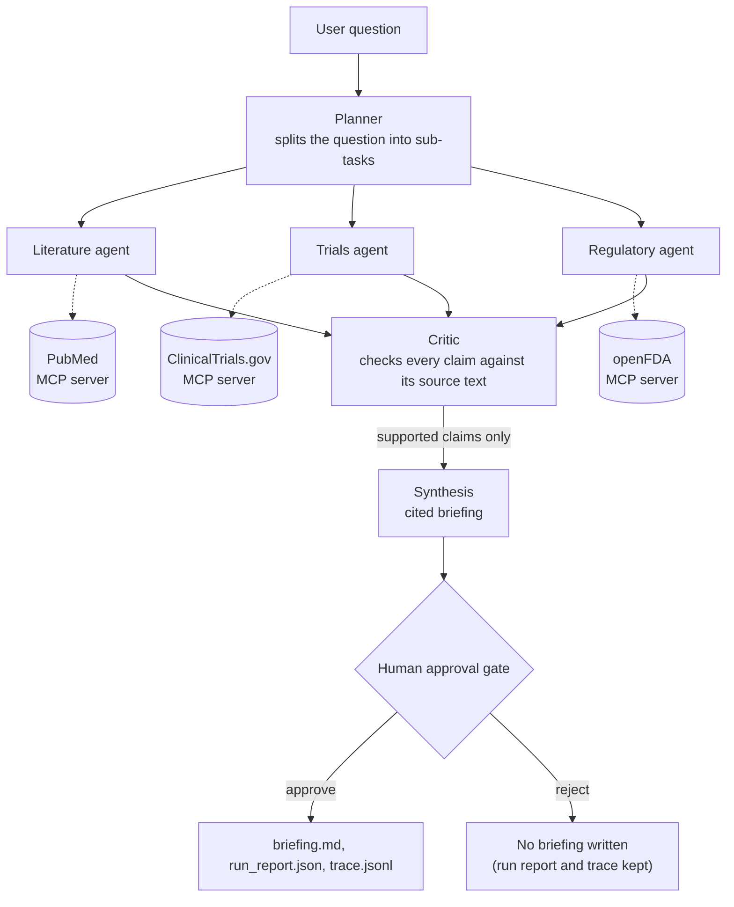

# mash-agent

A multi-agent system that answers questions about the MASH/MASLD (metabolic dysfunction-associated steatohepatitis / steatotic liver disease) landscape with a **cited briefing in which every claim was checked against a retrieved source**, together with a trace of how the agents produced it.

> **Demo and learning exercise. Not a clinical tool and not medical advice.** It exists to exercise production-grade patterns for multi-agent systems in one small repo: orchestration, tool contracts, claim-level verification, human-in-the-loop approval, observability, cost tracking and evaluation. The MASH topic is a vehicle. openFDA data is not validated for clinical use. All data comes from public sources (PubMed, ClinicalTrials.gov, openFDA).

## What it does

Ask a question in plain language:

```bash
uv run mash-agent "Summarize the current state of late-stage MASH therapies and the safety information in resmetirom's label."
```

A planner splits the question into sub-tasks. Three specialists (literature, trials, regulatory) run **in parallel**, each against one public API, and propose findings tagged with a source ID (PMID, NCT ID, or label ID plus section). A **critic** then checks every claim against the full text of its cited source, and only claims it supports are used to write the briefing. You review the exact briefing at an **approval gate** before anything is saved.

A run takes about 15 to 60 seconds (plus however long you take to review the briefing) and costs about $0.05 for a question that needs one specialist, up to about $0.40 for a broad question that uses all three, in model usage.

### Example output

An abridged excerpt of a real run (2026-09-28: 53 s, $0.29, 35 of 36 proposed claims passed the critic). This is the raw `briefing.md`; the run used an earlier version of the extraction prompt (see [Evaluation](#evaluation)).

```markdown
# MASH/MASLD landscape briefing

**Question:** Summarize the current state of late-stage MASH therapies and the safety information in resmetirom's label.

*Generated 2026-09-28. Not medical advice.*

## Approved therapy: indication and label safety (REZDIFFRA)

- REZDIFFRA is a THR-beta agonist indicated with diet and exercise for adults with noncirrhotic MASH with moderate to advanced liver fibrosis (stages F2 to F3). [LABEL:e67ea09f-a840-439c-86c8-f98585f978b2/indications_and_usage](https://api.fda.gov/drug/label.json?search=set_id%3A%22e67ea09f-a840-439c-86c8-f98585f978b2%22)
- The label lists no contraindications. [LABEL:e67ea09f-a840-439c-86c8-f98585f978b2/contraindications](https://api.fda.gov/drug/label.json?search=set_id%3A%22e67ea09f-a840-439c-86c8-f98585f978b2%22)
- In clinical trials, cholelithiasis, acute cholecystitis, and obstructive pancreatitis (gallstone) were observed more often with REZDIFFRA than placebo; treatment should be interrupted if an acute gallbladder event is suspected. [LABEL:e67ea09f-a840-439c-86c8-f98585f978b2/warnings_and_cautions](https://api.fda.gov/drug/label.json?search=set_id%3A%22e67ea09f-a840-439c-86c8-f98585f978b2%22)

## Late-stage pipeline (Phase 3)

- Boehringer Ingelheim's Phase 3 LIVERAGE trial of survodutide in MASH with moderate or advanced fibrosis is recruiting; Part 1 primary endpoints are MASH resolution without fibrosis worsening and at least 1-stage fibrosis improvement without MASH worsening. [NCT06632444](https://clinicaltrials.gov/study/NCT06632444)

## Evidence synthesis: network and meta-analyses

- For MASH resolution without worsening fibrosis, pegozafermin (SUCRA 91.75), survodutide (90.87), and tirzepatide (84.70) ranked highest; resmetirom, semaglutide and lanifibranor were also significantly better than placebo. [PMID:39903735](https://pubmed.ncbi.nlm.nih.gov/39903735/)

## What was searched
- PubMed query: (MASH OR NASH OR ...) AND (resmetirom OR ...) (15 sources retrieved, 12 claims proposed)
- ...
- Only retrieved sources are covered; other therapies, trials or publications may exist.

## Coverage and limitations
- The critic excluded 1 of 36 claims as not supported by their cited source.

## Sources cited
- [PMID:39903735](https://pubmed.ncbi.nlm.nih.gov/39903735/) - Comparison of pharmacological therapies in metabolic dysfunction-associated steatohepatitis ... (Hepatology, 2025)
- ...
```

The briefing states what was searched and what was excluded, so a reader can see its boundaries.

## How it works



| Component | Responsibility |
|---|---|
| **Planner / supervisor** | Decomposes the question, runs specialists in parallel (LangGraph fan-out), and isolates failures: every call has a timeout and retries with backoff, and a failing specialist becomes a recorded failure instead of sinking the run. If planning fails, every specialist gets the whole question. |
| **Literature, trials, regulatory agents** | Each plans a query, fetches sources through its tool, and extracts findings with a verbatim quote. Findings citing a source that was not retrieved are dropped. |
| **MCP servers** | Thin, self-written servers with typed contracts, a per-tool rate limiter, retries on 429/5xx, and an on-disk cache. They can also run standalone (`python -m mash_agent.mcp_servers.pubmed`). |
| **Critic** | A separate model call per cited source; sees the full source text and the claim, not the extractor's quote. Fails closed: anything unsupported or unchecked is excluded. |
| **Synthesis** | Groups verified claims into sections. Citations are rendered in code from claim numbers, so a bullet can only cite claims that passed the critic. |
| **Approval gate** | The graph genuinely pauses (LangGraph `interrupt`) and shows you the exact briefing. Anything but an explicit yes is a rejection. |
| **Run report and trace** | Per-stage tokens, cost and latency, retries and failures (`run_report.json`), and an OpenTelemetry span tree of agents, LLM calls and tool calls (`trace.jsonl`). |

Design rationale, and the evidence behind the choices, is in [docs/design-decisions.md](docs/design-decisions.md).

## Setup

Requires [uv](https://docs.astral.sh/uv/) (it installs Python 3.13 for you) and an Anthropic API key. The three data APIs need no registration.

```bash
git clone https://github.com/wgillett/mash-agent.git && cd mash-agent
uv sync
export ANTHROPIC_API_KEY=...           # required
export NCBI_EMAIL=you@example.com      # recommended: NCBI asks callers to identify themselves
```

### Run

```bash
uv run mash-agent "What safety information does the FDA label for resmetirom contain?" --out-dir out
```

A live status line shows progress, then the proposed briefing appears in a panel and asks `Approve and write briefing.md? [y/N]`. Approve to write the files; reject (the default) to write only the run report.

| Command | Purpose |
|---|---|
| `mash-agent "question"` (same as `mash-agent run "question"`) | Run the pipeline. `--out-dir DIR`, `--auto-approve` (skip the gate; evals and CI only), `--no-trace`, `-v` (library HTTP logging) |
| `mash-agent report run_report.json` | Show the cost/latency summary of a saved run |
| `mash-agent trace trace.jsonl` | Show the span tree (agents, LLM calls, tool calls, failures) |
| `mash-agent eval run` / `eval compare` | Evaluate on the fixed question set; see [Evaluation](#evaluation) |

Exit codes for `run`: `0` approved, `1` rejected, `2` no claim passed verification (nothing to approve).

**Outputs** (in `--out-dir`): `briefing.md` (only if approved), `run_report.json` (always: plan, per-agent outcomes, every critic verdict and reason, token/cost/latency summary) and `trace.jsonl`.

### Docker

```bash
docker build -t mash-agent .
docker run --rm -it \
  -e ANTHROPIC_API_KEY -e NCBI_EMAIL \
  -v "$PWD/out:/out" -v mash-cache:/cache \
  mash-agent "What safety information does the FDA label for resmetirom contain?"
```

`-e NAME` (without a value) passes the variable from your shell, so the key never appears on the command line. Results appear in `./out` on your machine (the run prints the container paths, `/out/...`). `-it` is needed for the approval prompt; without a terminal use `--auto-approve`. On Linux, if writing to `./out` is denied, add `--user "$(id -u):$(id -g)"`. Subcommands work the same way, for example `docker run --rm mash-agent eval run --help`.

### Configuration

| Variable | Default | Purpose |
|---|---|---|
| `ANTHROPIC_API_KEY` | required | Model access |
| `MASH_AGENT_MODEL` | `claude-sonnet-5-5` | Model for planner, specialists, critic and synthesis |
| `NCBI_EMAIL` | placeholder | Sent to NCBI with each request, per their guidelines |
| `NCBI_API_KEY`, `OPENFDA_API_KEY` | unset | Optional; raise the providers' rate limits |
| `MASH_AGENT_CACHE_DIR` | `.cache/mash-agent` | On-disk API response cache (24 h) |
| `MASH_AGENT_OUT_DIR` | `.` | Default `--out-dir` for `run` |
| `MASH_AGENT_PRICES` | built-in table | JSON `{"model-id": [input, output]}` in $ per million tokens; unknown models give no cost estimate |
| `MASH_EVAL_JUDGE_MODEL`, `MASH_AGENT_EVAL_DIR` | `claude-opus-5-5`, `eval_results` | Eval judge model and results root |

Costs are estimates from list prices, not a bill.

## Evaluation

`mash-agent eval run` runs a fixed set of 14 questions (`evals/questions.yaml`: regulatory, trials, literature and mixed questions, plus an advice-seeking and an off-topic one) end to end, and writes `report.json` (machine-readable), `summary.md` (short), per-question runs and a `spotcheck.jsonl` sample to `eval_results/<timestamp>-<variant>/`. It asks before spending money.

```bash
uv run mash-agent eval run --limit 2 --no-canary      # smoke test, about $0.3 (about $1 estimated up front)
uv run mash-agent eval run                            # full run, about $5, about 6 minutes
uv run mash-agent eval compare eval_results/<dir-a> eval_results/<dir-b>
```

How claims are scored:

- An **independent judge** (a different model, default `claude-opus-5-5`, with a different graded prompt) grades every claim the specialists propose as supported, partial or unsupported, *before* the critic acts. That yields the error rate before the critic, the residual error in what reaches the briefing, and how many bad claims the critic caught or missed. The judge is an LLM: an independent check, not ground truth.
- A **canary** corrupts real claims in known ways (changed number, flipped direction, swapped drug, added mortality claim) and counts how many the critic still passes. It does not depend on the judge.
- **Deterministic checks**: every bullet is cited, every cited source was retrieved, every claim passed the critic; advice-like phrases; topic coverage terms; an out-of-scope question should verify nothing.
- Cost and latency per run. Rates come with counts and 95% confidence intervals, and `compare` reports the difference between runs with an interval.

### Latest results

14 questions per run, 2026-09-29, `claude-sonnet-5-5` with `claude-opus-5-5` as judge. Percentages are of proposed claims. **Single runs**, except the two `legacy` runs pooled.

| | `legacy` prompt (2 runs pooled) | **`no-commentary` (default)** |
|---|---|---|
| Claims proposed | 528 | 299 |
| Judged unsupported, before the critic | 0.0% (0/528) | 0.0% (0/299) |
| Partly or not supported, before the critic | 4.5% (24/528) | 1.3% (4/299) |
| Partly or not supported, **after** the critic | 1.0% (5/492) | 0.3% (1/293) |
| Excluded by the critic | 6.8% (36/528) | 2.0% (6/299) |
| Good claims wrongly excluded by the critic | 3.4% (17/504) | 1.0% (3/295) |
| System cost, mean per question | about $0.20 | $0.21 |
| Latency, mean per question | about 30 to 33 s | 33 s |

The critic passed **0 of 536** deliberately corrupted claims in the canary (run with the `legacy` prompt).

What this shows and does not show:

- The extraction prompt `no-commentary` (state only what the source states; no interpretation, grouping or claims about what a source does not say) cut critic exclusions by about two-thirds against two `legacy` runs that agreed closely (7.3% and 6.3%). `quote-anchored`, an alternative, did about as well; `source-terms` did nothing. Details and the decision are in [docs/design-decisions.md](docs/design-decisions.md#evaluation-milestone-6).
- The judge rated **no** claim unsupported in the `legacy` and `no-commentary` runs (at most about 1.3% at 95% confidence). The critic's value is mostly on subtler overreach: of the 24 partly supported claims in the `legacy` runs, it excluded 19 (79%).
- The remaining error after the critic (about 1%) is a handful of claims and did not change between variants.
- These are small samples. Claims are not independent (the same claim recurs across questions), so the intervals are optimistic. The eval measures accuracy and topic coverage, not whether a briefing is useful, and the judge has not been calibrated against hand labels (`spotcheck.jsonl` is provided for that).

## Development

```bash
uv sync                                        # includes dev dependencies
uv run pytest                                  # the suite never touches the network
uv run ruff check . && uv run ruff format --check .
uv run mypy                                    # strict, over src and tests
uv run pre-commit install                      # ruff + mypy on commit
```

Tests use recorded API responses and scripted models. `scripts/` holds live checks that need network access and API keys and are not part of the suite: `live_smoke.py` (calls the three data APIs and can re-record the fixtures with `--record`), `live_specialists.py`, `live_supervisor.py`, and `critic_canary.py` (critic miss rate on a saved run).

```
.
├── AGENTS.md                 # project spec and conventions
├── Dockerfile
├── docs/design-decisions.md  # why it is built this way, with evidence
├── evals/                    # questions.yaml, run_evals.py
├── scripts/                  # live checks (network, API keys)
├── src/mash_agent/
│   ├── cli.py                # Click command group, Rich output
│   ├── agents/               # specialists, critic, synthesis, prompts, LLM seam
│   ├── graph/                # supervisor and full workflow (LangGraph)
│   ├── mcp_servers/          # PubMed, ClinicalTrials.gov, openFDA servers
│   ├── cache/  ratelimit/    # on-disk cache; per-tool limiter
│   ├── observability/        # tracing, metering, pricing, run summary
│   └── evals/                # judge, metrics, canary, runner, report
└── tests/
```

## Design decisions in brief

- **Supervisor with specialists** so each data source has its own failure and rate-limit handling, and one failure does not sink the run.
- **A separate critic, run on the full source text**, because the model that proposed a claim is the worst judge of it. It fails closed.
- **Provenance by construction:** citations are rendered from claim numbers that passed the critic, not from model-written text.
- **A human approval gate** that pauses the graph and shows exactly what would be saved.
- **Measured, not assumed:** an independent judge and a corrupted-claim canary evaluate the critic, and a prompt change was adopted only after repeated runs showed it helped.

## Known limitations

- The briefing's final wording is not re-checked against the sources; only the claims it is built from are.
- The trials specialist keeps some low-relevance results (for example old academic NAFLD trials) that take slots from the current MASH pipeline.
- Abstracts only: no full text. Coverage is whatever the three APIs return for the planner's queries, and the briefing lists what was searched.
- The judge is an LLM and is not calibrated against hand labels; results are single runs on 14 questions.
- Model output varies from run to run.

## License

MIT. See [LICENSE](LICENSE).
